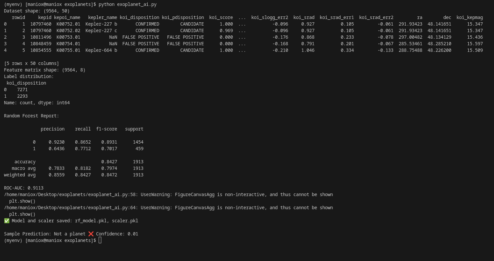
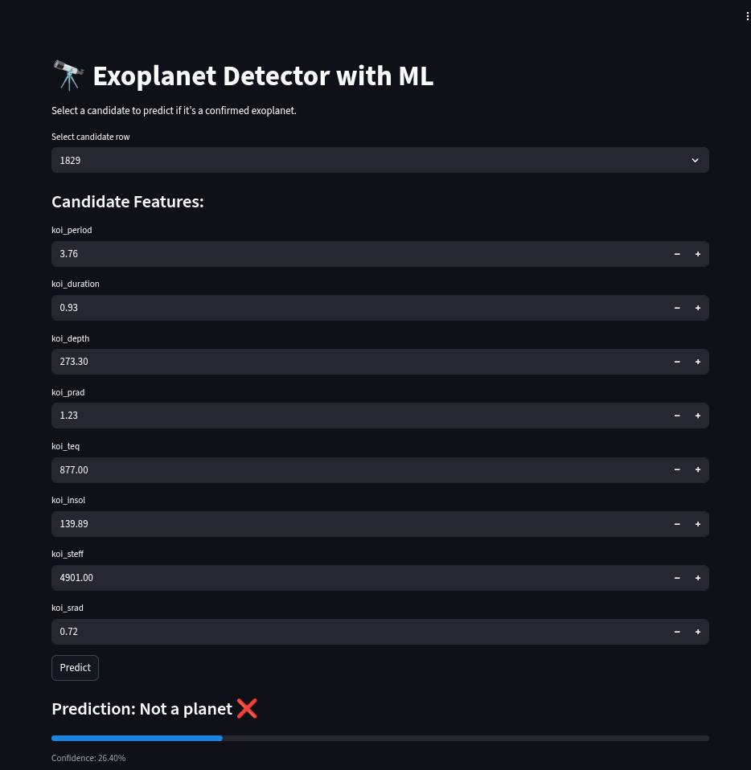
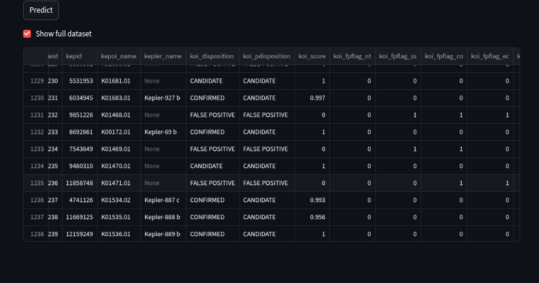

# 🔭 Exoplanet Detector with AI 🚀


Predict confirmed exoplanets from NASA Kepler candidate data using **AI**!  
Interactive **Streamlit app** makes exploration & predictions fun and easy. 🌌✨

---

## **✨ Features**

- Predict if a candidate is a confirmed exoplanet 🌍
- Handles **imbalanced data** with SMOTE
- Pre-filled feature inputs in Streamlit
- Visualizations:
  - Confusion Matrix 📊
  - Feature Importance 🔑
- Quick demo for hackathon presentation

---

## **📂 Dataset**

- File: `cumulative.csv` (Kepler exoplanet summary)
- Features:  
  `koi_period`, `koi_duration`, `koi_depth`, `koi_prad`,  
  `koi_teq`, `koi_insol`, `koi_steff`, `koi_srad`
- Label: `koi_disposition` (`CONFIRMED`=1, others=0)

> **Note:** This version uses CSV summary features (FLUX sequences optional).

---

## **⚡ Quick Start**

1. **Clone repo:**
```bash
git clone https://github.com/<your-username>/exoplanet-detector.git
cd exoplanet-detector
```

2. **Install dependencies:**
```bash
python -m venv myenv
source myenv/bin/activate   # Linux/macOS
myenv\Scripts\activate      # Windows
pip install -r requirements.txt
```

3. **Train model:**
```bash
python exoplanet_ai.py
```

4. **Run Streamlit app:**
```bash
streamlit run app.py
```

- Open the URL in your browser (e.g., `http://localhost:8501`)  
- Select a candidate → view pre-filled features → click **Predict**  
- Get prediction: **Exoplanet 🌍✨** or **Not a planet ❌** with confidence score  
- Optionally, view full dataset

---

## **📊 Project Structure**

```
exoplanet-detector/
│
├─ cumulative.csv      # Dataset
├─ exoplanet_ai.py     # Training script
├─ app.py              # Streamlit app
├─ rf_model.pkl        # Saved Random Forest model
├─ scaler.pkl          # Saved scaler
├─ requirements.txt    # Python dependencies
└─ README.md           # Documentation
```

---

## **🎬 Demo / Screenshots**

1. **Generating pkl files:**  
  

2. **Prediction Example:**  
  

3. **Viewing Dataset**  
  


---

## **🤝 Contributing**

- Fork the repo & submit pull requests
- Ideas:
  - Add full FLUX sequence support
  - Integrate CNN models for higher accuracy
  - Improve Streamlit visuals & interactivity

---

## **📜 License**

MIT License – Open Source

---

## **💡 Notes**

- Works with **summary CSV data** (no FLUX sequences required)
- Predicted outputs:
  - **Exoplanet 🌍✨** → confirmed candidate
  - **Not a planet ❌** → unconfirmed
- Confidence score is shown for each prediction

